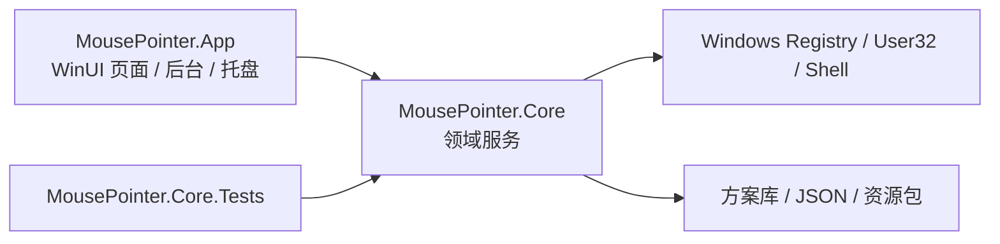

# 架构说明

## 分层



## Core

- `Models`：`CursorRole`、`CursorSchemeManifest`、`ScheduleItem`。
- `Infrastructure`：路径、JSON、错误日志、名称清洗。
- `Services`：
  - `CursorMatcher`：文件名和编号匹配。
  - `InfSchemeParser`：INF 解析。
  - `ArchiveExtractor`：资源包解压。
  - `CursorSchemeStore`：方案库读写。
  - `CursorAssetConverter`：图片转 `.cur`。
  - `WindowsCursorService`：注册表和 User32 刷新。
  - `ScheduleService`：切换规则读写和下次切换文案。
  - `StartupService` / `FileAssociationService`：HKCU 集成。
  - `InstallerPackageBuilder`：生成方案安装器 exe。

## App

- `MainPage`：四个工作区，分别是方案、资源库、自动切换、设置。
- `BackgroundRunner`：后台规则循环。
- `TrayIconHost`：纯 Win32 托盘图标，避免 WinForms/WPF 依赖污染 WinUI 工程。
- `ViewModels`：UI 行数据，不承载系统逻辑。

## 数据目录

默认根目录：

```text
%APPDATA%\MouseCursorThemeBuilder
```

关键文件：

- `settings.json`
- `schedule.json`
- `week_schedule.json`
- `cursor_backup.json`
- `mouse_files\schemes\<方案名>\scheme.json`

## 迁移改进点

- 原 Python 版的全局函数和 monkey patch 被拆成明确服务。
- 角色匹配有单元测试覆盖，避免 `link` 被 `ink` 误判。
- WinUI 工程只发布 x64，避免声明未验证架构。
- 系统写入集中在 `WindowsCursorService`，便于后续增加权限检查和真机验证。

