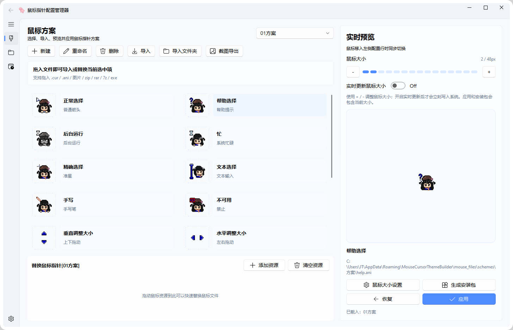
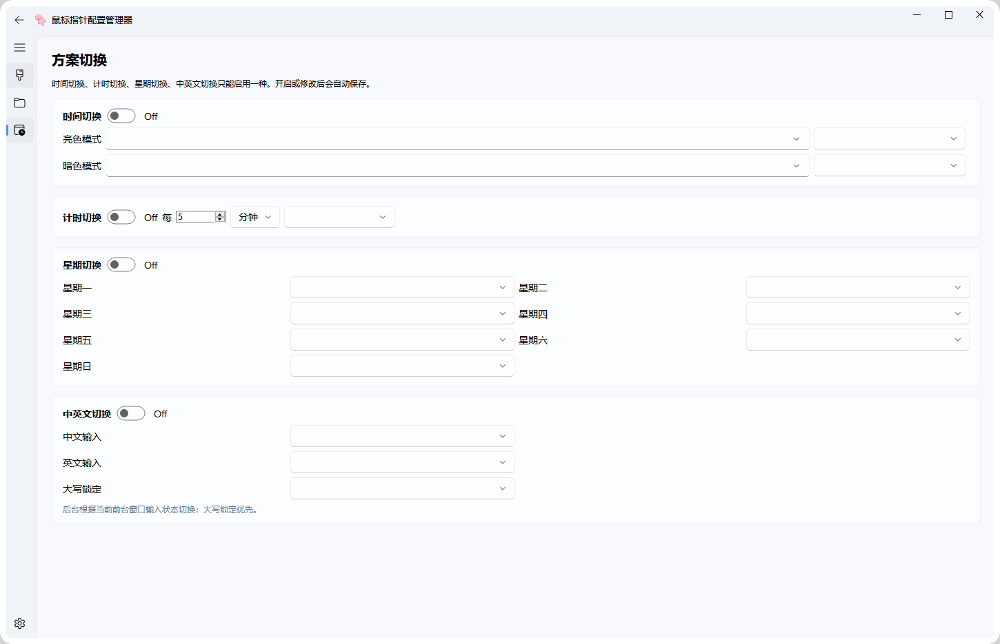
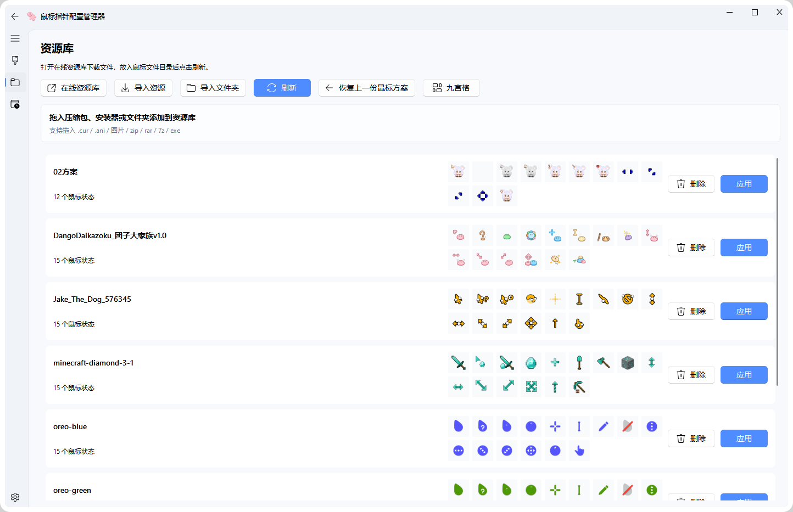

# Mouse Pointer Manager

[中文](README.md) | [English](#mouse-pointer-manager)

A graphical Windows cursor scheme manager. It is designed for beginners while also helping cursor creators edit, preview, apply, and package cursor themes.

[Download](https://github.com/yuanyue1234/MousePointer/releases/download/v2.0.0/MousePointer_Portable.exe)

## Screenshots







## Features

- Create, rename, delete, import, and auto-save cursor schemes.
- Import `.cur`, `.ani`, common images, `.zip`, `.rar`, `.7z`, `.exe`, and folders.
- Read `.inf` files from resource packages and batch-import multiple cursor schemes from one archive.
- Apply schemes even when only part of the cursor roles are configured.
- Preview static and animated cursor files in real time.
- Adjust cursor size with `- / +` controls and a segmented progress bar.
- Export scheme preview screenshots as `.gif`, including animated frames when available.
- Configure the cursor file storage location. The default path is `%APPDATA%\MouseCursorThemeBuilder\mouse_files`.
- Add desktop shortcuts, check for updates, enable background startup, hide the taskbar icon, and repair startup settings.
- When background startup is enabled, closing the window keeps the tray/background process alive.

## Recommended

- Auto Dark Mode: switch light/dark mode and theme together  
  https://apps.microsoft.com/detail/XP8JK4HZBVF435?hl=zh-Hans-CN&gl=CN&ocid=pdpshare

- InputTip: useful for changing cursor schemes based on Chinese/English input state  
  https://inputtip.abgox.com/zh-CN/

- Cursor resources for InputTip  
  https://inputtip.abgox.com/zh-CN/download/extra

## References

- Pixel cursor guide  
  https://mp.weixin.qq.com/s/DyO-dBMKf7RrMetCqji4jg

- Made by ASUNNY  
  https://asunny.top/

## Run From Source

```powershell
.\.venv\Scripts\python.exe -m pip install -r requirements.txt
.\.venv\Scripts\python.exe main.py
```

## Build

```powershell
.\.venv\Scripts\python.exe -m PyInstaller -y --clean "鼠标指针配置生成器_绿色程序.spec"
```

Output:

```text
dist\鼠标指针配置生成器_绿色程序.exe
release-assets\鼠标指针配置生成器_绿色程序.exe
```

## Maintenance

When updating the project introduction, keep `README.md`, `README.en.md`, and `介绍.md` in sync.
*** Add File: C:\Users\JT\Desktop\Agent\鼠标配置生成器\介绍.md
# 鼠标指针配置管理器

Windows 鼠标指针方案图形化管理工具。它面向新手用户，也兼顾鼠标指针制作者的编辑、预览、应用和生成安装包流程。

[下载软件](https://github.com/yuanyue1234/MousePointer/releases/download/v2.0.0/MousePointer_Portable.exe)

## 软件截图


## 主要功能

- 新建、重命名、删除、导入和自动保存鼠标指针方案。
- 支持 `.cur`、`.ani`、常见图片、`.zip`、`.rar`、`.7z`、`.exe` 和文件夹导入。
- 导入资源包时识别 `.inf`，支持一个压缩包内包含多份鼠标指针方案。
- 支持只配置部分鼠标状态，未配置的状态不会阻断应用流程。
- 右侧实时预览支持静态和动态鼠标指针，动态 `.ani` 会播放。
- 鼠标大小使用 `- / +` 和分段进度条调整，避免滑块误触。
- 截图导出保存为 `.gif`，有动态指针时会导出多帧动图。
- 设置页可修改鼠标文件存放位置，默认位于 `%APPDATA%\MouseCursorThemeBuilder\mouse_files`。
- 支持添加桌面快捷方式、检测更新、自启动后台、隐藏任务栏和自启动修复。
- 开启自启动后台后，关闭窗口会保留后台或托盘；托盘左键打开窗口，右键菜单提供打开、隐藏任务栏和退出。

## 推荐

- Auto Dark Mode：支持切换亮暗同时切换主题  
  https://apps.microsoft.com/detail/XP8JK4HZBVF435?hl=zh-Hans-CN&gl=CN&ocid=pdpshare

- InputTip：适合配合中英文输入状态切换鼠标指针  
  https://inputtip.abgox.com/zh-CN/

- 中英文切换鼠标指针资源（InputTip）  
  https://inputtip.abgox.com/zh-CN/download/extra

## 参考

- 像素指针指南文章  
  https://mp.weixin.qq.com/s/DyO-dBMKf7RrMetCqji4jg

- 工具制作 BY ASUNNY  
  https://asunny.top/

## 维护说明

更新项目介绍时，请同步更新 `README.md`、`README.en.md` 和 `介绍.md`。
