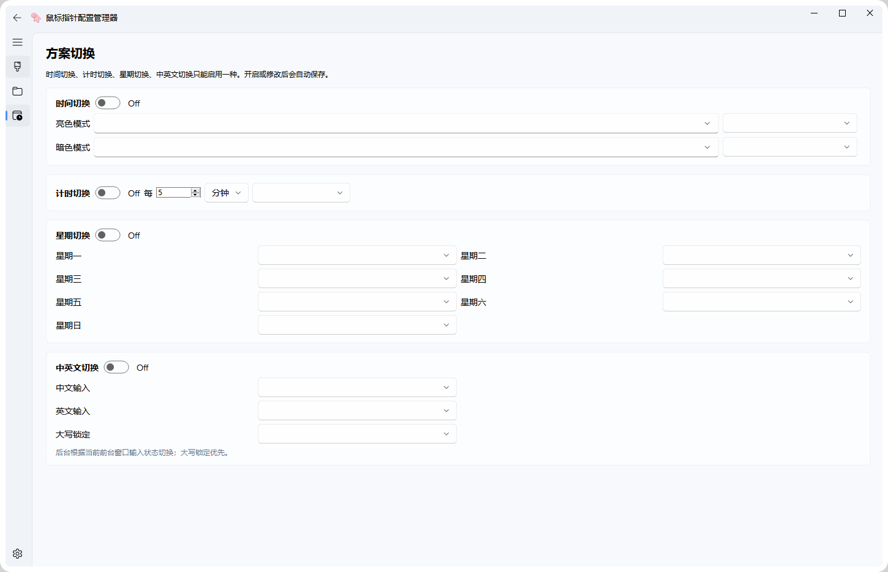
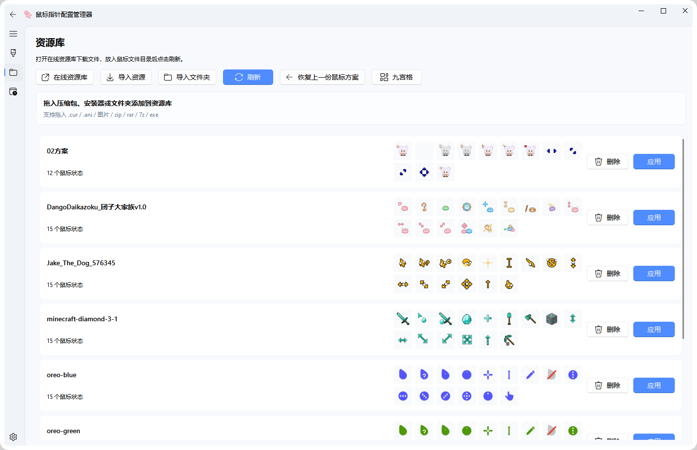

# Mouse Pointer Manager

Windows cursor scheme manager for importing, previewing, applying, and packaging cursor themes.

[Download portable build](https://github.com/yuanyue1234/MousePointer/releases/download/v2.1.1/MousePointer_Portable.exe)

[Open resource library](https://yuanyue1234.github.io/MousePointer/resources/)

## Screenshots

## Features

- Import `.cur`, `.ani`, images, `.zip`, `.rar`, `.7z`, `.exe`, and folders.
- Detect `.inf` files in cursor packages and build schemes automatically.
- Preview static and animated cursors.
- Apply schemes to Windows and restore the previous scheme.
- Build a single-file portable package for testing and release.

## References

- InputTip: https://inputtip.abgox.com/zh-CN/
- InputTip extra cursor resources: https://inputtip.abgox.com/zh-CN/download/extra
- PyQt-Fluent-Widgets: https://github.com/zhiyiYo/PyQt-Fluent-Widgets
- Pixel cursor guide: https://mp.weixin.qq.com/s/DyO-dBMKf7RrMetCqji4jg
- ASUNNY: https://asunny.top/
